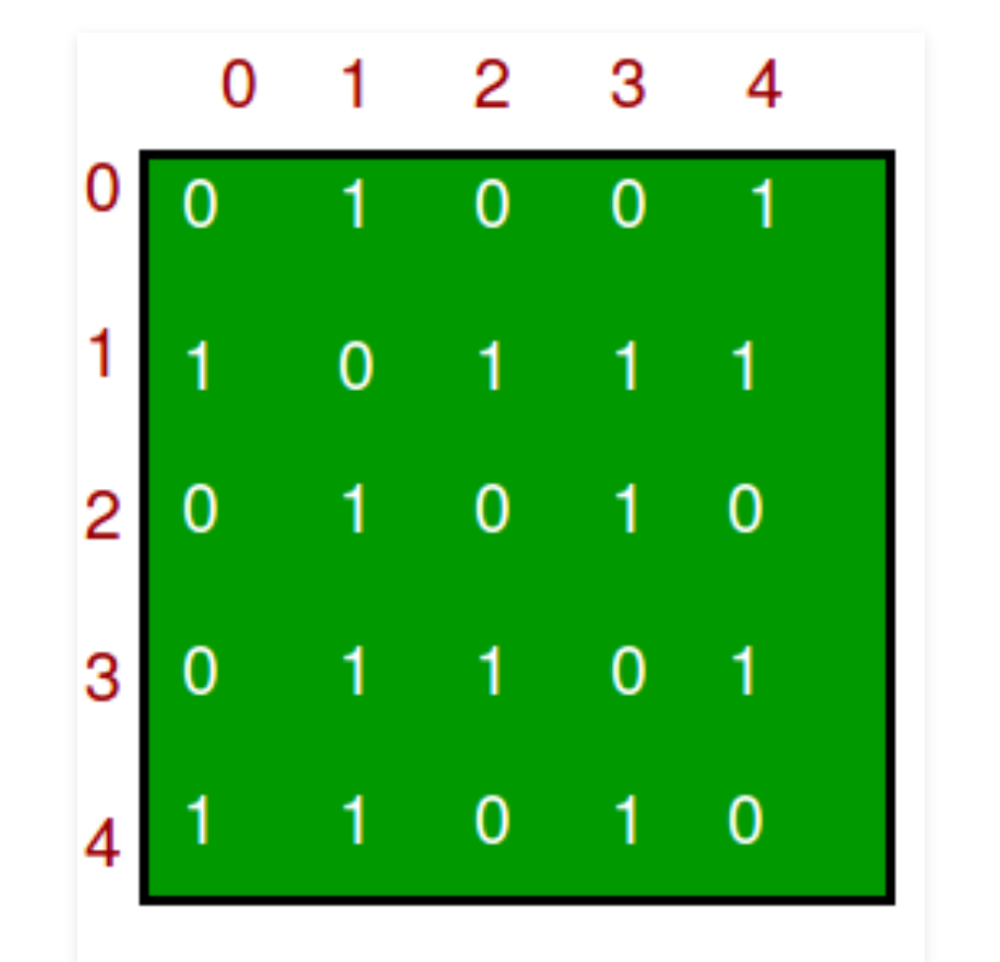

There are no differences between the words Node and Vertex.

most commonly used representations of a graph.
1. Adjacency Matrix - is a 2D array of size V x V where V is the number of vertices in a graph.
2. Adjacency List

Graph: 

Its adjacency matrix:

