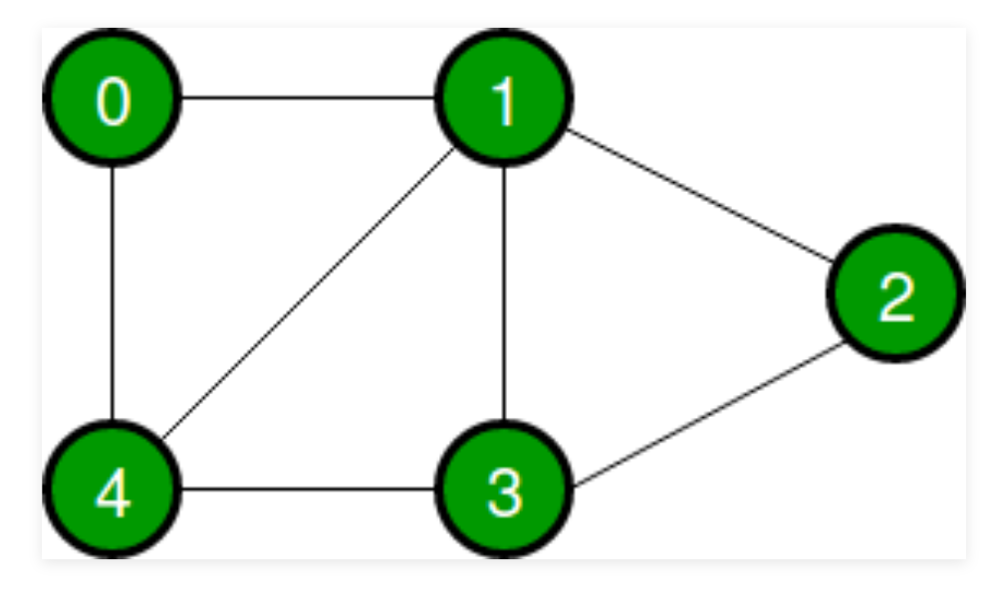
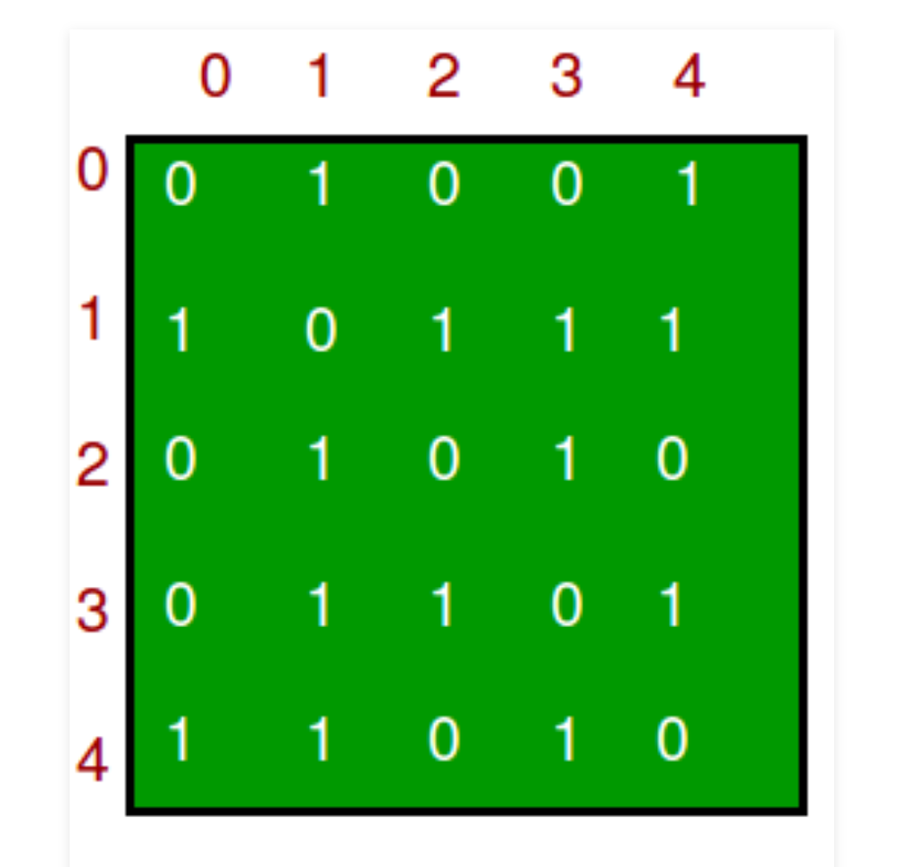
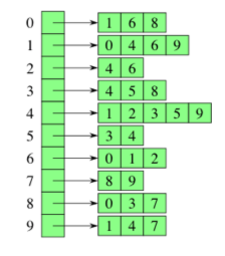
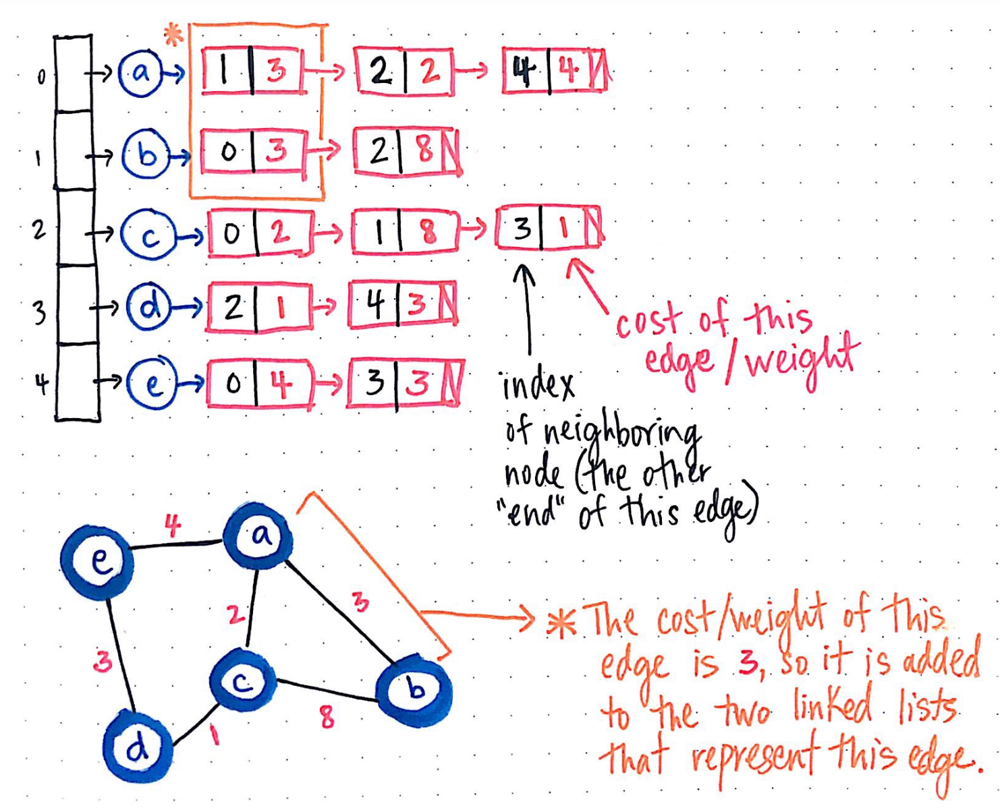

There are no differences between the words Node and Vertex.

most commonly used representations of a graph.
0. Edge list: array all edges (can be an array of 2 or 3 elements (if weighted))
1. Adjacency Matrix - is a 2D array of size V x V where V is the number of vertices in a graph.
2. Adjacency List - For each vertex i, store an array of the vertices adjacent to it. 

Graph: 

Edge list:

[[0,1], [0,6], [0,8], [1,4], [1,6], 
 [1,9], [2,4], [2,6], [3,4], [3,5],
 [3,8], [4,5], [4,9], [7,8], [7,9]
]

Its adjacency matrix:

Adjacency List: 

Weighted graph example in adjacency list format:

For undirected graphs: the edge between nodes a and b will appear twice:
 — once in the edge list for node a 
 - and once in the edge list for node b
 